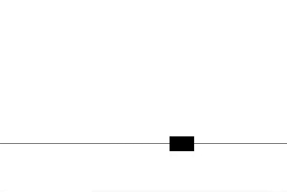
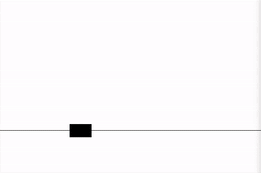

# Custom Gym Environment for Deep Reinforcement Learning

This repository implements a method to build custom gym environments to train Deep Reinforcement Learning Agents.

## Strategy

1. Control 1D-Mass system around a set point.
2. Engineered TD3 Agent using PyTorch to solve the environment.
3. Agent to minimize use of force[u] to reach the set state [position, velocity].
4. Reward Engineering is based on control system strategy.

## Codebase Structure

1. [CartENV.py](CartENV.py): Custom gym environment.
2. [train.py](train.py): Script to train the agent.
3. [test.py](test.py): Tests the agent.
4. [profile.py](profile.py): Plots graphs of training & testing.
5. [TD3.py](TD3.py): Deep Reinforcement Learning Agent.

## Install Prequisites

```bash
    $ pip install -r requirements.txt
```

## How to run?

1. To Test

```bash
    $ python test.py
```

2. To Train

    The [data](data) folder already has trained agents. Training again will overwrite the trained agents.

```bash
    $ python train.py
```

3. To Profile

```bash
    $ python profile.py
```

3. Test ENV. with random actions.

```bash
    $ python dummy_run.py --render True
```

## Profile Analysis

|Agent Policy Training|Testing Agent|
|:--:|:--:|
|||
|Untrained Agent|Trained Agent|
|||

## Developer

1. Name: Kanishk Navale
2. Email: navalekanishk@gmail.com
3. Website: https://kanishknavale.github.io/

## Note

1. Project is developed in Ubuntu 20.04 system.
2. The python scripts is developed using 'Python 3.8.10' and 'pip3'.
